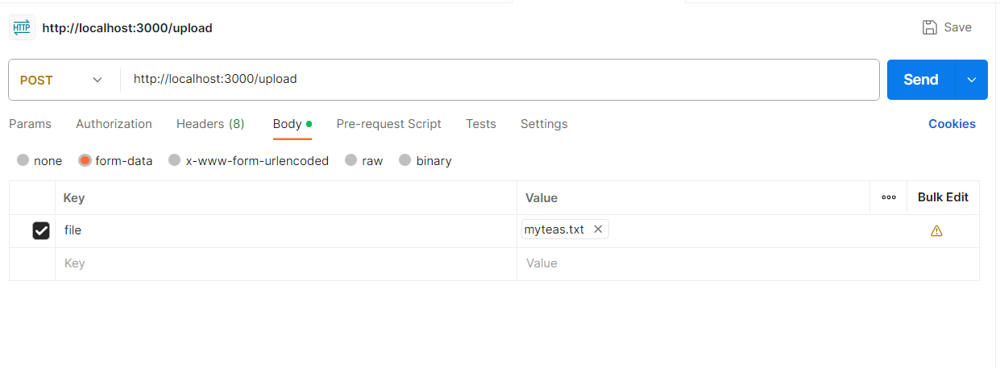
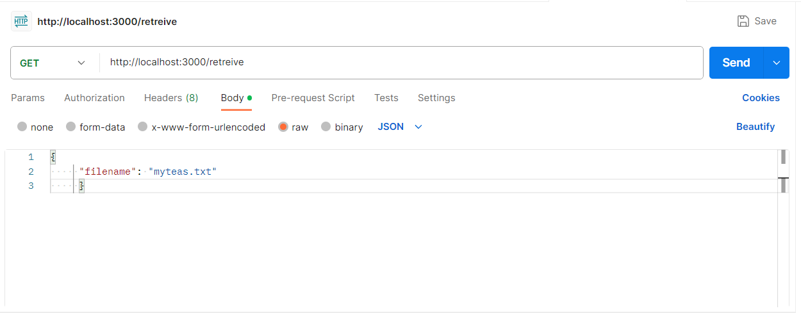

# IPFS-API

A commonJS API that allows you to store your files on IPFS and retrieve them from IPFS based on the filename.

In ESM we would use ipfs-core or helia without dynamic importing, I want to do this in commonJS and use Helia and use dynamic imports.

This API spawns two HELIA nodes one is used to write files and one is used to retrieve them
A video with an improved version and explanation:
https://www.youtube.com/watch?v=q5bKjuu3kdE
# Run the server

```
npm install
npm start
```
# you have the first endpoint /upload

POST request -->  body/Form-data --> key=file, value=yourfile.extension 

example: 



# the second endpoint /retreive is like dis:

GET request body/raw/JSON, 
```
{
    "filename": "the_name_of_the_file_you_uploaded.extension"
}
```
example:




# Questions

Why hashmaps ? well IPFS/Helia uses content addressing, there is no easy way to store the file with it's name and encodings, simply we just write the buffer and each buffer is under a CID, and I don't expect you to memorize the CID, i ALSO LOVE HASHMAPS <3


